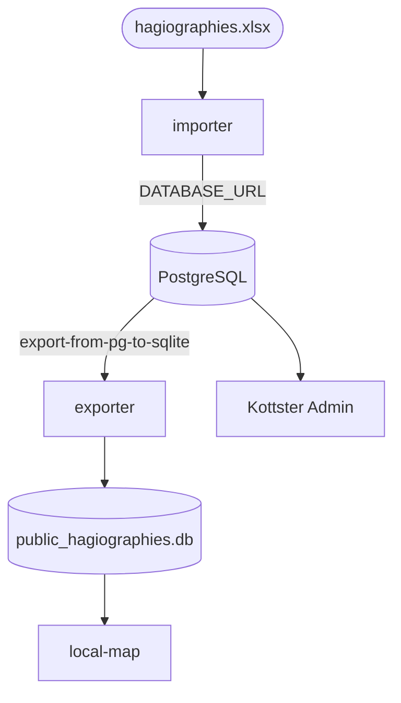

# PostgreSQL Migration Guide

This document describes the transition from a SQLite-centric architecture to a PostgreSQL-primary workflow. 

## Current State: Dual-Database Support

The project currently supports both **SQLite** and **PostgreSQL**.
- **SQLite** is the default for local development and legacy imports.
- **PostgreSQL** is configured as the primary backend for the Kottster admin panel (data management).

## Future State: PostgreSQL as Primary

To move towards a setup where PostgreSQL is the "Source of Truth" and SQLite is purely an export artifact, the recommended **Target Workflow** is:

1.  **Rebuild**: Restart the stack with clean state.
2.  **Import**: Import Excel data into PostgreSQL.
3.  **Export Map**: Generate GeoJSON from PostgreSQL.
4.  **Export SQLite**: Generate a filtered SQLite database from PostgreSQL.

This sequence ensures data flows from the most robust source (PG) to the lightweight artifacts (GeoJSON, SQLite).

### Target justfile sequence:
```just
reinit: rebuild reset-db import-pg export-from-pg-to-sqlite map-data
```

## Current Configuration (SQLite-Primary)

For the time being, **SQLite** remains the primary source for the Kottster admin panel and the standard map export.

- `just import`: Targets SQLite.
- `just import-pg`: Targets PostgreSQL (side-by-side).
- `just export-map`: Exports from SQLite.
- `just reinit`: Follows the dual import flow: `rebuild, import (SQLite), import-pg (PG), export-map (from SQLite)`.

### 3. Source-Agnostic Export Scripts
The export scripts (`export_map.py` and `export_sqlite.py`) are designed to be **source-agnostic**. They use the `DATABASE_URL` environment variable to determine their source.

- To export from SQLite (default):
  `just export-map`
- To export from PostgreSQL:
  `just export-from-pg-to-sqlite` (sets `DATABASE_URL=$PG_DATABASE_URL`)

## Data Flow Diagram



## Production Deployment
In production, ensure the `postgres` service is backed by a persistent volume (`postgres-data`) and that all services reference the internal Docker network for connectivity.
