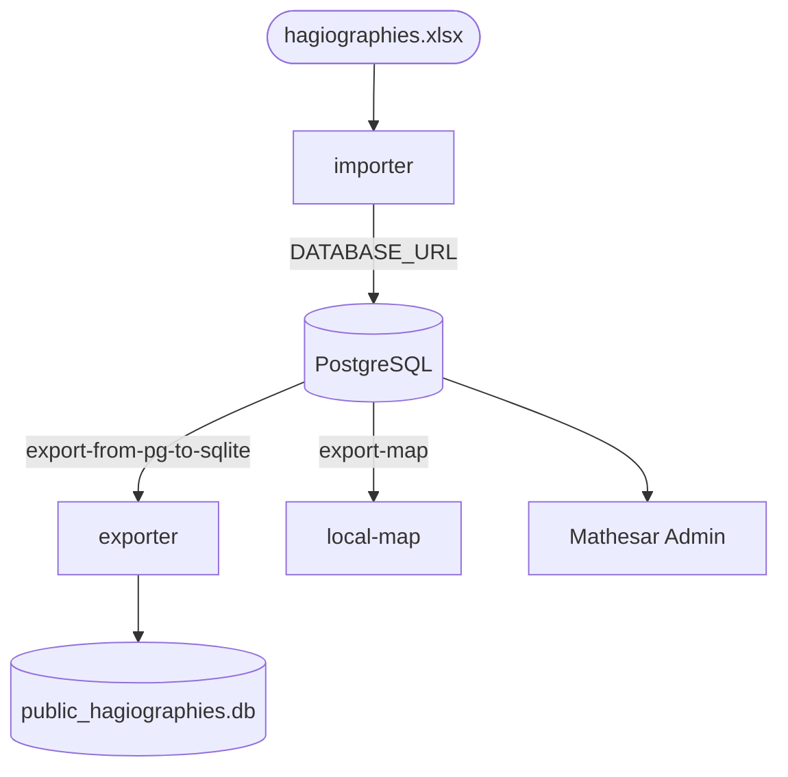

# PostgreSQL Architecture

This document describes the PostgreSQL-primary architecture of the Hagiographies project. The migration from the earlier SQLite-centric setup is **complete**.

## 1. Current Status: PostgreSQL-Primary

- **PostgreSQL** is the single "Source of Truth": the importer and SQLModel data model target it.
- **Mathesar** is the admin UI, editing PostgreSQL directly (no separate admin database adapter to configure).
- **SQLite** (`public_hagiographies.db`) is a derived, publishable snapshot produced by `just export-from-pg-to-sqlite` (dropping columns listed in `exporter/filter.json`).
- **Map data** is generated from PostgreSQL via `just export-map`.

---

## 2. Lifecycle Commands

- **Import**: `just import-pg` loads `hagiographies.xlsx` into PostgreSQL (passes `DATABASE_URL=$PG_DATABASE_URL`).
- **Migrate**: `just export-from-pg-to-sqlite` reflects PostgreSQL and writes the filtered SQLite snapshot.
- **Map**: `just export-map` reads PostgreSQL → GeoJSON and copies it into `local-map/data/`.
- **Full reset**: `just reinit` runs rebuild → reset-db → import-pg → migrate → export-map → map-data.

---

## 3. Data Flow


```mermaid
graph TD
    Excel([hagiographies.xlsx]) --> Importer[importer]
    Importer -->|DATABASE_URL| PG[(PostgreSQL)]
    PG -->|export-from-pg-to-sqlite| Exporter[exporter]
    Exporter --> SQLite[(public_hagiographies.db)]
    PG -->|export-map| MapLibre[local-map]
    PG --> Mathesar[Mathesar Admin]
```

---

## 4. DevOps & Production Operations

### Persistence
The PostgreSQL data is persisted via the `postgres-data` named volume. Ensure this volume is backed up regularly.

### Performance & Optimization
- **Triggers**: PostgreSQL uses an automated trigger to manage the `updated_at` column (defined in `utilities/model.py`). No manual logic is required in the admin panel.
- **Backups**: Use `pg_dump` within the container for snapshots:
    ```bash
    docker compose exec postgres pg_dump -U user_name db_name > backup.sql
    ```

### Connectivity
Always use the service name `postgres` as the hostname in connection strings when services are communicating within the Docker network.
