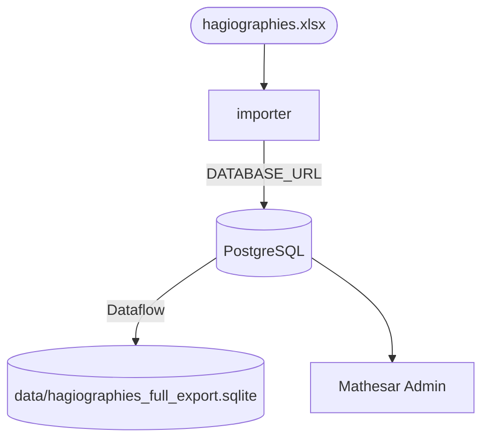

# PostgreSQL Architecture

This document describes the PostgreSQL-primary architecture of the Hagiographies project.

## 1. Current Status: PostgreSQL-Primary

- **PostgreSQL** is the single "Source of Truth": the importer and SQLModel data model target it.
- **Mathesar** is the admin UI, editing PostgreSQL directly (no separate admin database adapter to configure).

---

## 2. Lifecycle Commands

- **Import**: `just import-pg` loads the Excel workbook into PostgreSQL (passes `DATABASE_URL=$PG_DATABASE_URL`).
- **SQLite export**: `just export-from-pg-to-sqlite` dumps PostgreSQL to `data/hagiographies_full_export.sqlite` via Dataflow.
- **Full reset**: `just reinit` runs reset-pg → rebuild → import-pg → Mathesar bootstrap → summaries.

---

## 3. Data Flow



---

## 4. DevOps & Production Operations

### Persistence
The PostgreSQL data is persisted via the `postgres-data` named volume. Ensure this volume is backed up regularly.

### Performance & Optimization
- **Backups**: Use `pg_dump` within the container for snapshots:
    ```bash
    docker compose exec postgres pg_dump -U user_name db_name > backup.sql
    ```

### Connectivity
Always use the service name `postgres` as the hostname in connection strings when services are communicating within the Docker network.
